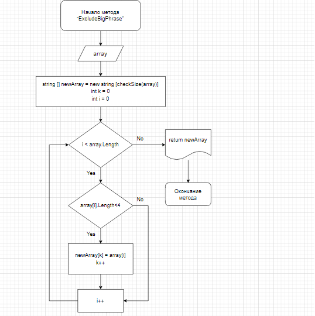

# **Итоговая контрольная работа**

## **Цель работы:**

1. Создать репозиторий на GitHub
2. Нарисовать блок схему
3. Написать программу

## **Ход работы**

Нарисовал блок - схему на сайте https://app.diagrams.net/

Сделал скриншот и сохранил в нужную папку

Опираясь на блок - схему написал программу

В программе сначала создается массив со строчными переменными (пользователь сам задаёт размер массива и вписывает фразы, которые его интересуют)

После массив выводится в консоле, чтобы пользователь был уверен, что все введено верно.

Дальше активируется метод "ExcludeBigPhrase". Он создаёт новый массив и заполняет его элементами, которые имеют меньше четырёх символов, из первоначального массива.

В методе "ExcludeBigPhrase" также имеется метод "checkSize" - он необходим для определения размера финального массива